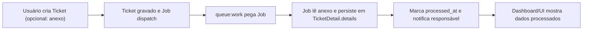

# ServiceHub

Aplicação web para gestão de ordens de serviço (tickets) com backend Laravel 12, Inertia.js/Vue 3 e processamento assíncrono de anexos em filas. Este README foi pensado para quem precisa subir o ambiente rapidamente ou entender os blocos principais do sistema.

## Principais funcionalidades
- Cadastro de Companies, Projects e Tickets, incluindo upload de anexo por ticket.
- Job `ProcessTicketAttachment` que lê o anexo, salva em `TicketDetail.details`, marca `processed_at` e notifica o responsável.
- Dashboard com métricas e últimos tickets.
- UserProfile separado do cadastro inicial (telefone, cargo, matrícula, departamento).
- Filas usando driver `database` (Redis disponível no ambiente para troca futura).

---

## Sumário
1. [Stack e Tecnologias](#stack-e-tecnologias)
2. [Requisitos](#requisitos)
3. [Como rodar o projeto](#como-rodar-o-projeto)
   - [3.1 Setup rápido (Quickstart)](#31-setup-rápido-quickstart)
   - [3.2 Setup detalhado](#32-setup-detalhado)
4. [Configuração (.env)](#configuração-env)
5. [Fluxo de processamento do anexo](#fluxo-de-processamento-do-anexo)
6. [Testes](#testes)
7. [Observabilidade e logs](#observabilidade--logs)
8. [Troubleshooting](#troubleshooting)
9. [Roadmap](#roadmap)
10. [Contribuição](#contribuição)
11. [Licença](#licença)
12. [Autor](#autor--contato)

---

## Stack e Tecnologias
- **PHP 8.2** + **Laravel 12**.
- **Inertia.js + Vue 3**, **Tailwind CSS**, **Vite**.
- **MySQL 8** para persistência.
- **Redis 7** disponível no docker (cache / futuras filas).
- **Queues** com driver `database` e jobs Laravel.
- **Docker / Docker Compose** para orquestração local.
- **Composer** e **npm** para dependências.

---

## Requisitos
- Docker 24+ e Docker Compose plugin.
- Node 18+ e npm (para rodar Vite).
- Portas livres: `8000` (app), `3306` (MySQL), `6379` (Redis).

---

## Como rodar o projeto

### 3.1 Setup rápido (Quickstart)
> Sequência solicitada pelo time (ajuste o ID do contêiner se diferente do seu ambiente).
```bash
docker compose up -d                               # 1. sobe os serviços
docker exec -it d5b312adb465 sh                    # 2. entra no contêiner da app (ou use `servicehub-app`)
php artisan key:generate                           # 3. gera APP_KEY (crie .env a partir de .env.example antes, se preciso)
php artisan migrate                                # 4. cria tabelas, inclusive jobs
npm run dev                                        # 5. inicia Vite em modo dev
php artisan queue:work                             # 6. worker da fila (use outro terminal)
```
Primeira vez? Dentro do contêiner rode também `composer install` e `npm install` antes do passo 5.

Aplicação: http://localhost:8000

### 3.2 Setup detalhado
1. **Clonar e criar `.env`**
   ```bash
   git clone <repo> servicehub
   cd servicehub
   cp .env.example .env
   ```
2. **Subir containers**
   ```bash
   docker compose up -d
   ```
   Serviços: `servicehub-app` (PHP + artisan + Vite), `servicehub-mysql`, `servicehub-redis`.
3. **Instalar dependências (dentro do contêiner)**
   ```bash
   docker exec -it servicehub-app sh
   composer install
   npm install
   ```
4. **Chave e banco**
   ```bash
   php artisan key:generate
   php artisan migrate
   ```
5. **Frontend (hot reload)**
   ```bash
   npm run dev
   ```
6. **Filas**
   ```bash
   php artisan queue:work
   ```
7. **Encerrar ambiente**
   ```bash
   exit
   docker compose down
   ```

---

## Configuração (.env)
Mantenha `.env.example` atualizado. Principais variáveis:

### App
| Variável | Exemplo |
|---|---|
| `APP_NAME` | ServiceHub |
| `APP_ENV` | local |
| `APP_URL` | http://localhost:8000 |
| `APP_DEBUG` | true |

### Banco de Dados
| Variável | Exemplo |
|---|---|
| `DB_CONNECTION` | mysql |
| `DB_HOST` | mysql |
| `DB_PORT` | 3306 |
| `DB_DATABASE` | servicehub |
| `DB_USERNAME` | servicehub |
| `DB_PASSWORD` | servicehub |

### Filas / Cache
| Variável | Exemplo |
|---|---|
| `QUEUE_CONNECTION` | database |
| `CACHE_STORE` | database |
| `REDIS_HOST` | redis |
| `REDIS_PORT` | 6379 |

### Sessão / Auth
| Variável | Exemplo |
|---|---|
| `SESSION_DRIVER` | database |
| `SESSION_LIFETIME` | 120 |

---

## Fluxo de processamento do anexo


---

## Testes
- `php artisan test` (ou `composer test`).
- Suíte cobre relacionamentos de domínio e fluxo do Job.

---

## Observabilidade / Logs
- Logs: `storage/logs/laravel.log`.
- Siga em tempo real: `docker compose exec servicehub-app tail -f storage/logs/laravel.log`.
- Para debug rápido, use `LOG_LEVEL=debug` e `LOG_CHANNEL=stack` (padrão).

---

## Troubleshooting
1. **`APP_KEY` ausente** — rode `php artisan key:generate`.
2. **`SQLSTATE[HY000] [2002] Connection refused`** — verifique se o serviço `mysql` está saudável (`docker compose ps`) e se o host no `.env` é `mysql`.
3. **Fila não processa** — confirme `php artisan queue:work` ativo e `QUEUE_CONNECTION=database`.
4. **Permissão em storage/cache** — dentro do contêiner: `chown -R www-data:www-data storage bootstrap/cache`.
5. **Porta 8000 ocupada** — altere o mapeamento em `docker-compose.yml` (ex.: `8080:8000`).

---

## Roadmap
- Alternar fila para Redis sem alterar código (apenas `.env` e horizon opcional).
- Seeds adicionais para dados de exemplo (companies, projects, tickets).
- Monitoração de jobs (Laravel Horizon) opcional.

---

## Licença
MIT.

## Autor / Contato
- **Max Mateus**
- GitHub: https://github.com/maxmateus
- LinkedIn: https://www.linkedin.com/in/max-mateus2021
